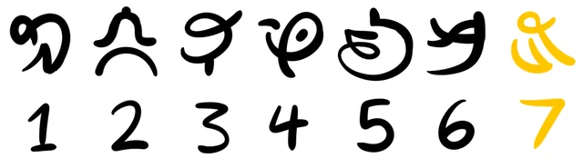

# 🍌 Banana-Fractone

Information for the Donkey Kong Bananza DLC: Banana Fractone

This repository contains notes and instructions for unlocking and playing the Banana Fractone challenge in the Donkey Kong Bananza DLC.

# 🚀 Getting Started

I use the following symbols as numbers:

This reference image was sourced from Reddit:
[🔗 View Original Post](https://www.reddit.com/r/donkeykong/comments/1nfcdkd/weird_banana_fractone_in_dlc_is_a_code_to_crack/)

## Step 1

Currently, no information is available for the first step. (If you discover it, please open an issue or PR to update this README!)

## Step 2 – The Punch Arm

This step requires motion controls:

- Equip your Joy-Cons.
- Punch with your left Joy-Con → increases the left counter
- Punch with your right Joy-Con → increases the right counter
- Continue until both counters reach 77.

## Step 3 – Next & Lock

Punch to cycle through to the next number.
Use your sonar to lock in the current number, then move on to the next of the three numbers.

## Step 4 - Directions

if you punch the Fractone from different directions you cycle trou different numbers

## Step 5 - Solve the Code

So you dont have to transform having the transformation highlighted is all you need.

|Transformation|1|2|3|4|5|
|---|---|---|---|---|---|
|Kong|1|1|0|0|1|
|Zebra|1|1|1|0|0|
|Ostrich|1|0|0|0|1|
|Snake|0|0|1|1|1|
|Elefant|1|0|0|1|1|

here is a little solver for you if you dont want to think
[Solver](code/solver.py)

## Step 6 - Gold Bonus Stages
Punching changes all slots
You canlock the slots by playing the bonus Stage thing the corisponding slot.

You can reset by re-entering the Layer

- Slot 1, Mountain Peak
- Slot 2, West Islet
- Slot 3, Banandiumtone's Floating Islet (near the puzzle itself)
- Slot 4, Cave above a waterfall
- Slot 5, The ship
- Slot 6, Beach cave under a cabin